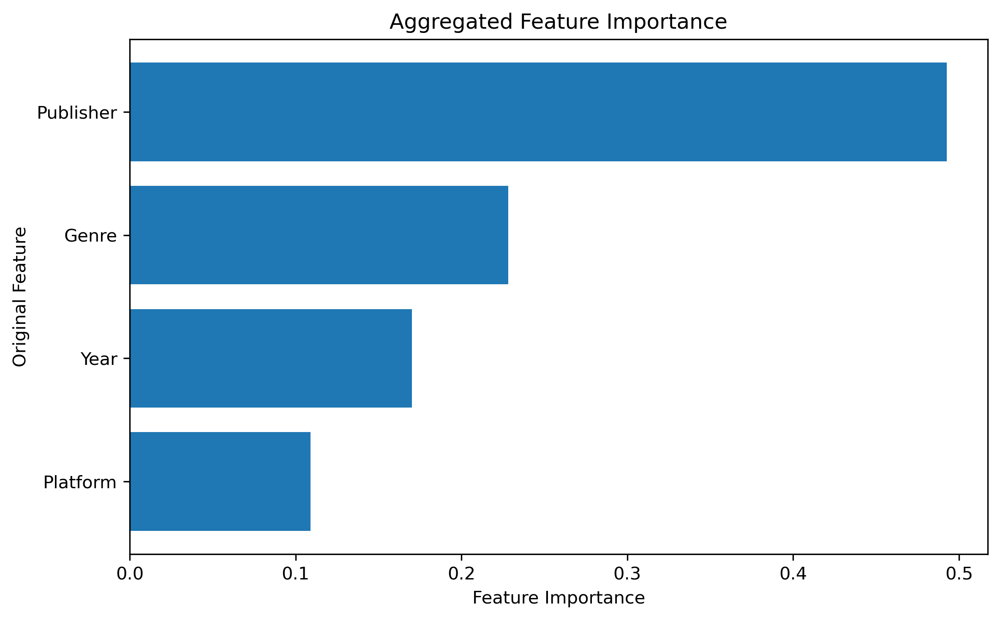

# 🎮 Video Game Sales Prediction — Machine Learning Project

## Project Overview

This project investigates whether historical video game characteristics can be used to predict **global video game sales**.

The project follows an end-to-end data science workflow, including data cleaning, exploratory data analysis, feature engineering, preprocessing, model development, hyperparameter tuning, model evaluation, residual analysis, and feature importance analysis.

A major finding of the project is that increasing model complexity did not substantially improve predictive performance. Further investigation suggests that the primary limitation is the **predictive information available in the dataset rather than the choice of machine learning algorithm**.

## 📓 Project Notebooks

The project is organized into five notebooks that follow the complete data science workflow:

1. [Business Understanding](notebooks/%2001_Business_Understanding.ipynb)
2. [Data Analysis](notebooks/02_Data_Analysis.ipynb)
3. [Business Insights & Market Strategy](notebooks/03_Business_%20Insights_%20Market_Strategy.ipynb)
4. [Advanced EDA & Feature Analysis](notebooks/04_Advanced_EDA_Feature_Analysis.ipynb)
5. [Feature Engineering & Machine Learning](notebooks/05_Feature_Engineering_Machine_Learning.ipynb)

The notebooks progress from defining the business problem and exploring the data to generating business insights, engineering features, developing machine learning models, evaluating performance, and identifying the limitations of the available predictive data.

The notebooks progress from defining the business problem and exploring the data to generating business insights, engineering features, developing machine learning models, evaluating performance, and identifying the limitations of the available predictive data.

The notebooks progress from defining the business problem and exploring the data to generating business insights, engineering features, developing machine learning models, evaluating performance, and identifying the limitations of the available predictive data.
The notebooks progress from defining the business problem and exploring the data to generating business insights, engineering features, developing machine learning models, evaluating performance, and identifying the limitations of the available predictive data.
Each notebook builds on the previous stage, progressing from business understanding and exploratory analysis through feature engineering, model development, evaluation, and final conclusions.
## Business Question

**Can video game sales be predicted using information about a game's publisher, genre, platform, and release year?**

A secondary objective was to determine which available characteristics contribute most strongly to the model's predictions.

---

## Dataset

The dataset contains historical information about video games and their sales performance.

The primary predictors used for modeling were:

- Publisher
- Genre
- Platform
- Year

The target variable represents video game sales.

Categorical variables were transformed using **one-hot encoding**, expanding the modeling dataset to **476 processed features**.

However, these 476 columns originate from only four underlying predictor variables.

---

## Technologies Used

- Python
- Pandas
- NumPy
- Matplotlib
- Scikit-learn
- Jupyter Notebook

---

## Project Workflow

### 1. Data Cleaning and Preparation

The dataset was inspected and prepared for machine learning. This included handling variable types, selecting predictors and the target variable, and preparing the data for preprocessing.

The data was separated into training and testing sets so that final model performance could be evaluated on previously unseen observations.

---

### 2. Exploratory Data Analysis

Exploratory analysis was conducted to better understand:

- The distribution of video game sales
- Relationships between predictors and sales
- Categorical distributions
- Potential outliers
- Skewness in the target variable

The sales variable exhibited substantial right skew, with a relatively small number of games achieving extremely large sales values.

---

### 3. Data Preprocessing

Categorical variables were converted into numerical representations using **OneHotEncoder**.

Preprocessing was fitted using the training data and subsequently applied to both the training and test datasets to prevent data leakage.

After encoding, the dataset contained **476 model features**.

---

## Machine Learning

Multiple regression algorithms were evaluated to determine whether different modeling approaches could capture the relationship between game characteristics and sales.

Models investigated included:

- Linear Regression
- Regularized Regression
- Support Vector Regression
- Random Forest Regression
- Gradient Boosting Regression
- Ensemble approaches

Models were evaluated using regression metrics including:

- Mean Absolute Error (MAE)
- Mean Squared Error (MSE)
- Root Mean Squared Error (RMSE)
- R²

---
## 📊 Model Comparison

Multiple regression approaches were evaluated to determine which modeling strategy best captured the relationship between the available game characteristics and global sales.

### Initial Test-Set Performance

| Model | MAE | RMSE | R² |
|---|---:|---:|---:|
| Baseline (Dummy Regressor) | 0.619 | 2.069 | 0.000 |
| Linear Regression | 0.569 | 1.978 | 0.085 |
| Optimized Lasso Regression | 0.548 | 1.977 | 0.086 |

Both Linear Regression and optimized Lasso improved upon the baseline, but their relatively low R² values suggested that linear approaches captured only a small portion of the variation in global video game sales.

### Tree-Based Model Comparison

Five-fold cross-validation was used to compare several nonlinear and ensemble regression approaches.

| Model | Mean CV RMSE | RMSE Std. Dev. |
|---|---:|---:|
| **Gradient Boosting** | **1.304** | 0.132 |
| Voting Ensemble | 1.399 | 0.092 |
| Random Forest | 1.431 | 0.097 |
| Extra Trees | 1.594 | **0.043** |

Gradient Boosting achieved the lowest mean cross-validation RMSE and was therefore selected for hyperparameter optimization.

### Optimized Gradient Boosting

GridSearchCV identified the following optimal parameters:

- **Number of estimators:** 200
- **Learning rate:** 0.10
- **Maximum depth:** 3
- **Minimum samples per leaf:** 3

The optimized model achieved a cross-validation RMSE of **1.278**.

When evaluated on the untouched test set, the optimized Gradient Boosting model produced:

| Metric | Result |
|---|---:|
| MAE | **0.521** |
| RMSE | **1.967** |
| R² | **0.095** |

The optimized Gradient Boosting model achieved the strongest test-set performance among the evaluated final models. However, an R² of 0.095 indicates that only approximately **9.5% of the variation in global sales** was explained by the available predictors.

Further residual analysis and target transformation were therefore conducted to investigate the model's remaining prediction errors.
## Hyperparameter Optimization

Promising models were further optimized using **GridSearchCV** and cross-validation.

For the log-transformed Gradient Boosting model, the best parameters identified were:

| Hyperparameter | Best Value |
|---|---:|
| Learning Rate | 0.10 |
| Maximum Depth | 4 |
| Minimum Samples per Leaf | 3 |
| Number of Estimators | 300 |

The best cross-validation RMSE was approximately **1.275**.

---

## Target Transformation

Residual analysis indicated that large sales values were particularly difficult for the models to predict.

Because the target distribution was strongly right-skewed, a logarithmic transformation was investigated using `TransformedTargetRegressor`.

`log1p` was applied during model training, while `expm1` automatically transformed predictions back to the original sales scale.

The tuned log-transformed Gradient Boosting model produced:

| Metric | Test Result |
|---|---:|
| MSE | 4.0106 |
| RMSE | 2.0026 |
| R² | 0.0625 |

The transformation did not improve test-set performance relative to the previous Gradient Boosting model.

---
## Feature Importance Analysis

To better understand why predictive performance remained limited, feature importance was extracted from the optimized Gradient Boosting model.

Because categorical variables were transformed using one-hot encoding, the original features were expanded into hundreds of individual binary features. Although the processed dataset contained **476 features**, these features originated from only four underlying predictors: **Publisher, Genre, Year, and Platform**.

To improve interpretability, the importance scores of the one-hot encoded features were aggregated back to their original variables.

### Aggregated Feature Importance

| Feature | Importance |
|---|---:|
| Publisher | 49.3% |
| Genre | 22.8% |
| Year | 17.0% |
| Platform | 10.9% |

### Interpretation

**Publisher was the dominant feature**, accounting for approximately **49.3%** of the model's total feature importance. Genre contributed approximately **22.8%**, followed by Year at **17.0%** and Platform at **10.9%**.

The results show that the model relied heavily on publisher information when predicting global video game sales. However, even with Publisher representing nearly half of the model's total feature importance, the optimized Gradient Boosting model achieved an R² of only **0.095** on the test set.

This combination of concentrated feature importance and relatively low predictive performance suggests that the available variables provide some useful signal but do not capture many of the factors responsible for differences in video game sales.

Additionally, although one-hot encoding expanded the dataset to **476 model features**, it did not create new underlying information. The model was still attempting to predict sales primarily from only four original variables.

These findings support the conclusion that further improvements in predictive performance may depend more on obtaining **additional informative features** than on increasing model complexity or continuing hyperparameter optimization.

Potential additional predictors could include:

- Critic review scores
- User review scores
- Marketing expenditure
- Game price
- Franchise popularity
- Release timing
- Promotional activity
- Preorders
- Digital versus physical distribution
- Market competition at release

> **Key takeaway:** Increasing the number of encoded features does not necessarily increase the amount of predictive information available to a machine learning model.

Feature importance represents how strongly the fitted Gradient Boosting model relied on each available predictor and should **not** be interpreted as evidence of a causal relationship with video game sales.

---
---

## Key Finding

Despite preprocessing, testing multiple algorithms, ensemble modeling, hyperparameter optimization, residual analysis, and target transformation, model performance remained relatively weak.

The final model explained only a small proportion of the variation in video game sales.

This suggests an important machine learning lesson:

> **Increasing model complexity cannot compensate for missing predictive information.**

Although one-hot encoding generated 476 model features, these features originated from only four underlying variables.

The primary limitation therefore appears to be the **information available in the dataset rather than simply the choice of algorithm**.

---

## Potential Improvements

Future versions of the project could incorporate additional variables that may contain stronger predictive information, including:

- Critic review scores
- User review scores
- Marketing expenditure
- Game price
- Franchise information
- Release timing
- Preorders
- Promotional activity
- Digital versus physical distribution
- Competition at release
- Broader market conditions

Additional information could allow machine learning models to better distinguish between games with similar publishers, genres, platforms, and release years but dramatically different sales outcomes.

---

## Conclusion

This project demonstrates an end-to-end machine learning workflow for a real-world regression problem, progressing from business understanding and exploratory analysis through feature engineering, model comparison, hyperparameter optimization, and model diagnostics.

Among the evaluated approaches, the **optimized Gradient Boosting model achieved the strongest test-set performance**, with an MAE of **0.521**, RMSE of **1.967**, and R² of **0.095**.

Although Gradient Boosting outperformed the baseline and other evaluated approaches, the model explained only approximately **9.5% of the variation in global video game sales**. Additional experimentation, including a log transformation of the target variable, did not improve generalization performance.

Feature importance analysis provided further insight into this limitation. Although one-hot encoding expanded the dataset to 476 model features, these features originated from only four underlying predictors: **Publisher, Genre, Year, and Platform**.

The results therefore suggest that the primary limitation is not simply model selection or hyperparameter optimization, but the **predictive information contained in the available data**. More accurate video game sales forecasting would likely require richer game-specific and market-level variables.

This project highlights an important machine learning lesson: **increasing model complexity cannot compensate for missing predictive information**. The resulting models are therefore best interpreted as exploratory predictive models rather than high-accuracy forecasting systems.

---

## Skills Demonstrated

- Data cleaning and preprocessing
- Exploratory data analysis
- Feature engineering
- One-hot encoding
- Train/test splitting
- Scikit-learn pipelines
- Regression modeling
- Ensemble machine learning
- Cross-validation
- Grid search hyperparameter tuning
- Target transformation
- Model evaluation
- Residual analysis
- Feature importance
- Diagnosing model limitations
- Translating technical results into business conclusions
